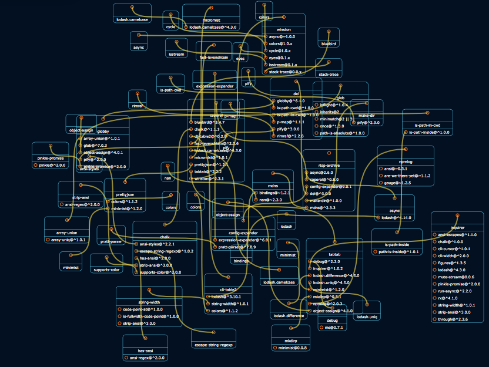

[](https://svelte.dev)
[](https://www.npmjs.com/package/npm-navigator)
[](https://spdx.org/licenses/0BSD.html)
[](https://bundlejs.com/?q=npm-navigator)
[](https://npmjs.org/package/npm-navigator)
[](https://github.com/arlac77/npm-navigator/issues)
[](https://actions-badge.atrox.dev/arlac77/npm-navigator/goto)
[](https://github.com/DevExpress/testcafe)

## npm-navigator

navigate npm dependencies visually



# API

<!-- Generated by documentation.js. Update this documentation by updating the source code. -->

### Table of Contents

-   [allModules](#allmodules)
-   [loadModule](#loadmodule)
    -   [Parameters](#parameters)

## allModules

module cache

## loadModule

Load and cache a module

### Parameters

-   `wiredPanels`  
-   `id` **[string](https://developer.mozilla.org/docs/Web/JavaScript/Reference/Global_Objects/String)** 
-   `version` **[string](https://developer.mozilla.org/docs/Web/JavaScript/Reference/Global_Objects/String)** 
-   `depth`  

Returns **[Object](https://developer.mozilla.org/docs/Web/JavaScript/Reference/Global_Objects/Object)** module

# install

With [npm](http://npmjs.org) do:

```shell
npm install npm-navigator
```

# license

BSD-2-Clause
